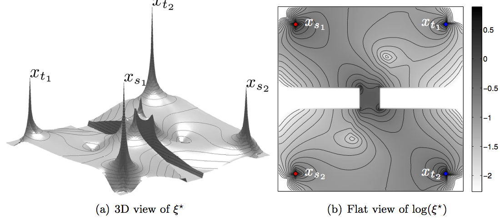

This Matlab package contains the source code to reproduce the figure of the article:

F. Benmansour, G. Carlier, G. Peyré, F. Santambrogio. [Derivatives with Respect to Metrics and Applications: Subgradient Marching Algorithm](https://hal.archives-ouvertes.fr/hal-00360794). Numerische Mathematik, 116(3), pp. 357–381, 2010.

F. Benmansour, G. Carlier, G. Peyré, F. Santambrogio. [Numerical Approximation of Continuous Traffic Congestion Equilibria](https://hal.archives-ouvertes.fr/hal-00360796/). Networks and Eterogeneous Media, 3(4), pp. 605–623, 2009.

Type

> help fm2dSubGradient

from mex directory.

Before executing examples from the main directory, mexify cpp file from matlab.
